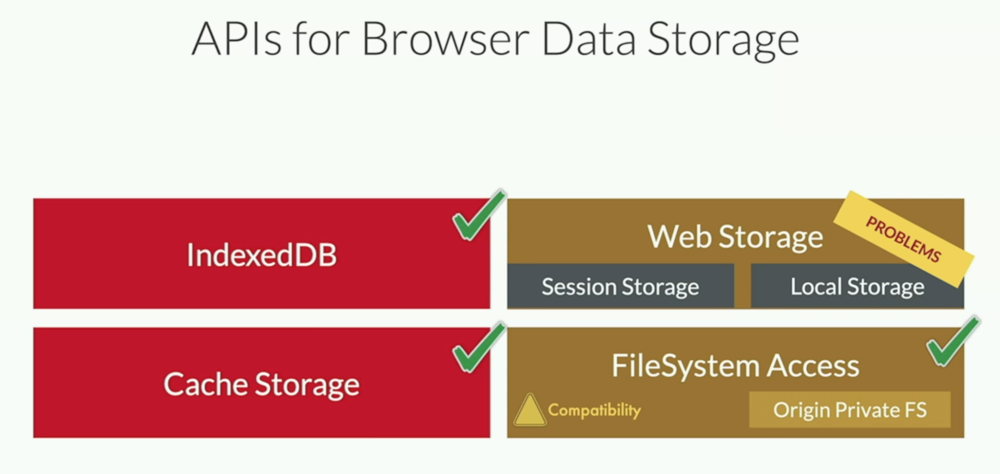

## Intruduction
  - [Learn PWA](https://web.dev/learn/pwa/)
  - https://firtman.github.io/browser-storage/
  - Why Browser Data Storage
  - Origin
    - an Internet domain
    - Protocol + Host + Port
      - www prefix
      - country TLDs, such as: amazon.com amazon.ca
      - firt.dev, learn.firt.dev
      - eTLD+1
        - co.uk is an eTLD
        - amazon.co.uk is an eTLD+1
      - Partitions and Safari
  - Web Client
    - Browser instance
    - PWA
    - Native app using a Web View
    - Custom Tabs(CT)
    - SafariViewController
    - TWA
  - On native apps, client-side data is contained to that device and it goes to a cloud backup
  - [On web apps, the world is much more complex](https://youtu.be/nkt5Vz7yIw8?feature=shared)
    - Navigating to the same origin, and same device, on same OS account in any time in the future* and
      - the same web client is used
## AIPS for Browser Data Storage
  - State of APIs
    - Cookies (Not suitable)
    - Web Storage (shouldn't using it anymore, has Problems, avoid using it)
      - Session Storage
      - Local Storage
    - WebSQL (Deprecated)
    - Application Cache (Deprecated)
    - IndexedDB 
      - json object
    - File and Directories (To be deprecated)
    - Cache Storage
      - full response from server
    - FileSystem Access
      - need user permission
      - Origin Private FS
      
  - Data Storage APIs Comparison
    - 
  - Web Storage
    - Simple API
    - Synchronous API
      - Performance issues
      - not available on Workers or Service Workers
    - We should try to avoid using it today
    - You can emulate them with IndexedDB
      ```
      localStorage.setItem("key", "value");
      const data = localStorage.getItem("key");

      localStorage.removeItem("key");
      localStorage.clear();
      ```
    - localStorage
      - It persist data between navigation and browser sessions
      - Quota is typically 5MB per origin
      - Strings are stored in UTF-16
      - At the end, it's around 2.5MB per origin
    - sessionStorage
      - It persist data within a browser's session storage
        - Include page reloads and restores
        - What's a session on mobile?
      - Quota is typically tetween 5MB and 12MB
  - Debugging Tools
    - https://storage-quota.glitch.me/
  - Quotas & Persistence
    - Quota includes:
      - One quota for all storages:
        - All the data from APIs:
          - Local storage
          - IndexedDB
          - Cache Storage
          - FileSystem(Origin Private FS)
        - Service Worker registrations
        - Web App Manifests from installed PWAs
    - Quota does not include:
      - Cookies
      - Files cached by the browser
      - Session Storage
      - Files created with the FileSystem Access API (on the real FS)
    - Quotas per browser
      - Chromium： 60% of total disk space per origin
      - Firefox： 50% of total disk space with a maximum of 2GB per group （eTLD+1）
      - Safari： 1GB per partition with increments of 200Mb with user's permission
      - http://www.filldisk.com/
      - Storage per origin can be defined as: Best Effort / Persistent
  - Persistent Storage Request
    ```
    if (navigator.storage && navigator.storage.persist) {
        const granted = await navigator.storage.persist();
        track('storage-persist-request', granted);
    }
    if (navigator.storage && navigator.storage.persist) {
        const isPersisted = await navigator.storage.persisted();
        track('storage-persisted', isPersisted);
    }
    ```


    